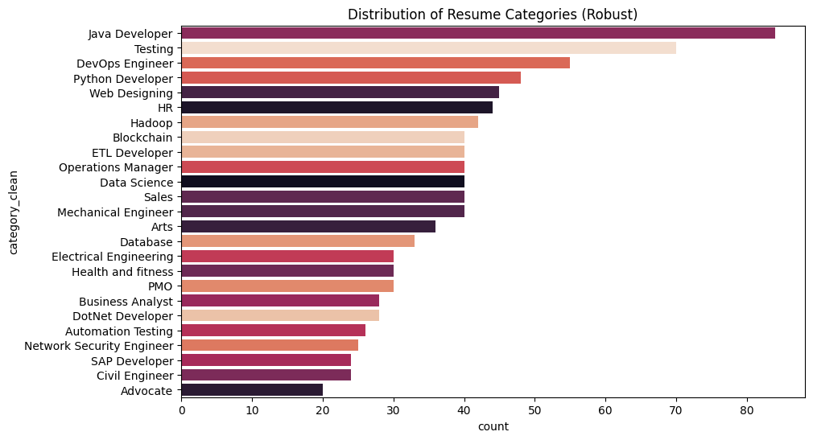
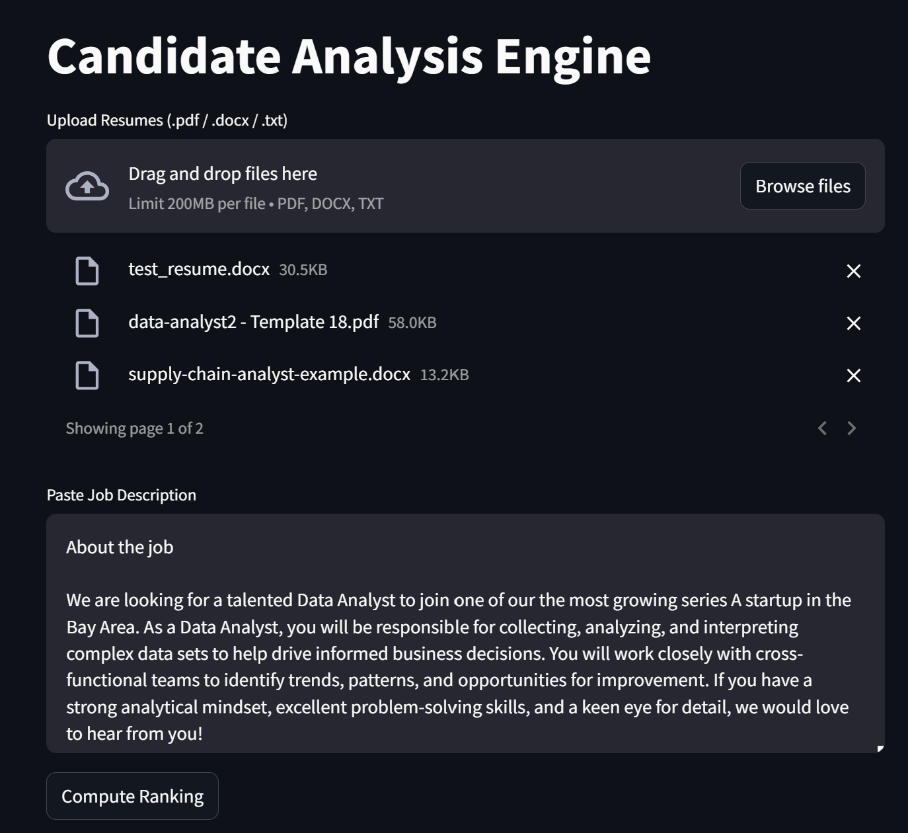
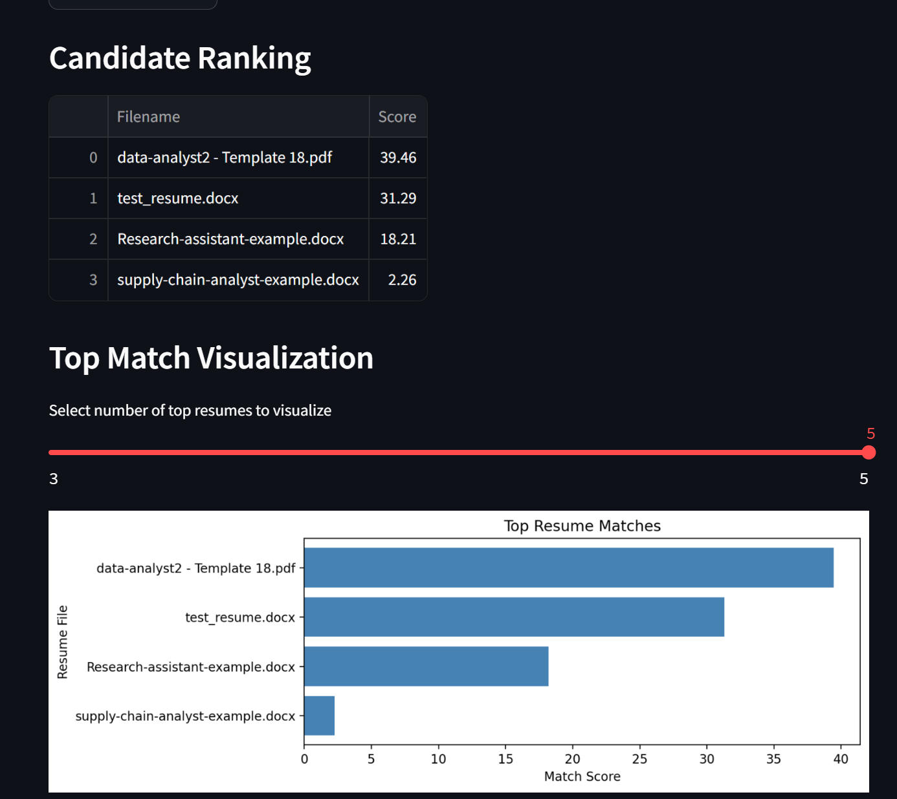

# Candidate Analysis Engine

---

## Project Overview

A compact, research-minded resume parsing and job-matching repository implemented in Python. This document follows the same structure and level of detail as the Language Translation example so the project is easy to consume on GitHub.

> NOTE: This repository is intended for learning, research experiments, and prototyping. It is not production-ready — see the Limitations section.

---

## Table of contents
- About
- Quick demo (notebook & UI)
- Key features
- Limitations
- Tech stack & model details
- System requirements
- Architecture & workflow
- Repository layout
- Installation
- Usage
- Caching & artifacts
- UI components
- Future work
- Contributing

---

## About
This project extracts structured information from resumes (skills, education, experience, contact info, etc.) using light NER-style heuristics and embeddings-based matching. It demonstrates a pipeline that goes from file extraction to entity extraction and candidate-job scoring.

---

## Quick demo — notebook & UI
- Notebook: `notebooks/proj9.ipynb` contains exploratory analysis, dataset QC utilities, and example token-label alignment helpers.



- UI: `app/streamlit_app.py` is a small Streamlit app that accepts resume uploads and a job description, computes similarity, ranks candidates, and renders feedback.





---

## Key features
- Resume text extraction: PDF, DOCX, and plain text support via `src.resume_parser.extractor`.
- Entity extraction: heuristics + optional spaCy NER when installed (`src.resume_parser.preprocessing`).
- Embedding-based scoring: sentence-transformers when available, deterministic fallback for smoke-tests (`src.resume_parser.scoring`).
- Streamlit demo for interactive ranking and feedback.

---

## Limitations
- Experimental: not production hardened (no authentication, scaling, or hardened API surface).
- Embedding/NER quality depends on installed models; smoke-mode uses deterministic fallbacks for rapid testing.
- No formal evaluation harness by default — add a hold-out dataset and eval scripts for production-grade assessments.

---

## Tech stack & model details
- Language: Python (3.8+; 3.10 recommended)
- UI: Streamlit
- Embeddings: `sentence-transformers` (e.g., `all-MiniLM-L6-v2`) — used when installed
- NER: spaCy models (e.g., `en_core_web_sm`) — optional
- Utilities: `pandas`, `matplotlib`, `pdfplumber`, `docx2txt`

See `requirements.txt` for the development dependencies used in the repo.

---

## System requirements
- Python 3.8+ (3.10 recommended)
- 4+ GB RAM for basic experiments; 8+ GB recommended when using non-quantized embedding models.
- GPU recommended for large-scale fine-tuning but not necessary for the demo or smoke-tests.

---

## Architecture & workflow
High-level flow:
1. Resume files uploaded or read from disk.
2. `extractor.py` extracts raw text from PDF/DOCX/TXT.
3. `preprocessing.py` cleans text and attempts NER (spaCy if available, heuristics otherwise).
4. `scoring.py` computes similarity between resume and job description (sentence-transformers if available, deterministic fallback for smoke tests).
5. Streamlit UI ranks candidates and displays feedback generated by `generate_feedback`.

> NOTE: The project is designed so the heavy-model dependencies are optional. This enables quick local validation while allowing you to upgrade to real models for production experiments.

---

## Repository layout
```
NLP/
├── app/                        # Streamlit UI
│   └── streamlit_app.py
├── src/                        # Package code
│   └── resume_parser/
│       ├── __init__.py
│       ├── preprocessing.py    # text cleaning & entity heuristics (lazy spaCy)
│       ├── extractor.py        # pdf/docx/txt extraction helpers
│       └── scoring.py          # similarity and feedback (lazy sentence-transformers)
├── notebooks/                  # Exploratory notebooks
│   └── proj9.ipynb
├── examples/                   # Small example data
│   └── minimal_resume.csv
├── scripts/                    # Run/test helpers
│   ├── run_smoke_train.py
│   ├── run_smoke_train_runner.py
│   └── run_tests_runner.py
├── tests/                      # Small unit tests
│   └── test_scoring.py
├── assets/                     # screenshots, diagrams
├── requirements.txt
├── flow.md                     # Migration & architecture notes
└── README.md                   # This file
```

---

## Installation
Recommended: use the included virtual environment under `temp/` if you already created it, or create a new venv.

Windows (cmd.exe):
```cmd
python -m venv .venv
.venv\Scripts\activate.bat
pip install -r requirements.txt
```

If you want to use the heavy models for real NER and embeddings:
```cmd
python -m pip install -r requirements.txt
python -m spacy download en_core_web_sm
python -c "from sentence_transformers import SentenceTransformer; SentenceTransformer('all-MiniLM-L6-v2')"
```

---

## Usage

Using the repository venv (example using `temp` venv if present):
```cmd
cd /d "d:\University\DS Bootcamp\DS Projects\NLP"
temp\Scripts\activate.bat
```

Run the Streamlit demo (if `streamlit` is installed in venv):

```cmd
streamlit run app\streamlit_app.py
```

The app includes a small `sys.path` bootstrap to make `src` importable; creating a minimal editable install (`pip install -e .`) removes the need for that bootstrap.

---

## UI components
- Header: title and short instructions.
- File uploader: accepts PDF/DOCX/TXT resumes.
- Job description area: paste job description.
- Translate/Score button: runs extraction, entity detection, similarity scoring.
- Results table: ranked candidates with score and feedback.
- Simple matplotlib chart for top-k visualization.

---

## Future work
- Add a small CLI or Streamlit extension to export results as CSV.
- Add evaluation scripts and a hold-out dataset for NER and matching (precision/recall/F1).
- Package `src/` and remove sys.path bootstrap; provide Dockerfile for reproducible runs.
- Add CI (GitHub Actions) to run the smoke tests and linters on PRs.

---

## Contributing
Contributions are welcome. Suggested workflow:
1. Fork the repository and create a feature branch.
2. Run scripts and tests locally.
3. Open a PR with a clear description and link to any related issue.